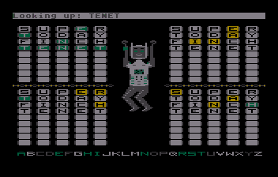

# Aqordl

## What is it?

A word puzzle game for the Atari 8-bit computers. With a dancing robot. And no social media.

Download from: https://github.com/glreno/wordy/releases

## Why?

Because "Wordl" is awesome, and "Dordle" and "Quordle" are awesomer. "Sedecordle" is awesomest, but it's really hard to fit 16 puzzles on an Atari screen.

I have seen a couple versions of Wordl for the Atari, but not Quordl, and of course no dancing robot.

Also, I've always wanted to write a dictionary.

## How to play

You might have seen a similar game. Enter a guess, and the letters will turn green or yellow. Green letters are correct. Yellow letters are in the word, but in a different location.

The twist here is that you are guessing four words at once.

The order of the words does not matter. If you get stuck on one word, work on a different word.

## System Requirements

- The disk version requires a 130XE.
  - It uses the bank-switched memory to hold the dictionary and animation data.
  - This is NOT compatible with a RAM disk.

- The cartridge version should run on any Atari 8-bit system with at least 16K RAM.
  - I have only tested this in emulation
  - It is a 64KB XEGS bank-switched cartridge (cartridge type 13)
  - This may or may not work on a real 400/800 system; I'm not sure the XEGS cartridge hardware is compatible
  - It works in emulation though!

- The text-only cartridge version will run in 8KB.
  - If you can find one of the unreleased 8KB Atari 400s, and you have the ability to burn a cartridge, and a 400 supports the XEGS cartridage bankswitch hardware.

## Starting the game

- Retrogames **THE400**
  - Plug a keyboard into one of the USB ports
  - Copy the aqordl_robot_1.02.car and aqordl_text_1.02.car file on to a thumb drive, and plug it into one of the USB ports.
  - Select "Media Access" from the carousel
  - Select the aqordl_robot_1.02 or aqordl_text_1.02 image
  - Press the Menu button to change the game settings
  - Any settings will work, but the emulator detects PAL instead of NTSC if there is no settings. So just open the settings, select "400" and close it.
  - Press Home to start the game

- Emulators
  - Pretty much any settings should work for the .car images
  - The .xex and .atr images require a 130XE with 128K RAM.

- A **Real** Atari 130XE
  - This is still untested, since my 130XE has been in storage for a couple decades
  - Copy the aqordl_robot_1.02.atr image to a blank single-density floppy. The image includes myPicoDos, and will boot directly into the game
  - Or you can load the aqordl_robot_1.02.xex file using your favourite method of loading .exe files
  - Either way, it's going to take a long time to load
  - The game does use all 128K, so do not use with a RAM disk

- Any other real hardware
  - I have no idea how to get this .car image onto a real physical cartridge. But that's what it would take.
  - The cartridge image is 64K XEGS (cartridge type 13)

## Options

- The dictionary is chosen at startup. Choose Easy, Normal, Hard, or Tough.
  - NTSC systems get the US dictionary
  - PAL systems get the UK dictionary.

- There are four levels of audio
  - Mute all
  - Key Click Off
      - Disables the Atari key click
  - Normal
  - Annoying
      - more sounds from the robot when checking his wrist computer

- Since you don't like my colours, press any number key to pick a different palette.
  - 9 is a high-contrast blue-orange scheme
  - 0 is suitable for black & white TVs

- Type "PLEASE" to access debug commands
  - no enter -- the final E triggers the debug mode
  - "PLEASE DANCE" plays the you-won-the-game animation
  - "PLEASE SADLY" plays the you-lost-the-game animation
  - "PLEASE JUMPY" plays the you-guessed-the-word animation

## Credit where Credit is Due

- Wordle was created by Josh Wardle 2021 and is &#174; New York Times 2022
- Quordle was created by Freddie Meyer 2022, and is a property of Merriam-Webster
- Developed using the cc65 cross-compiler, which is licensed under the zlib License

## Questionable Design Decisions

- Randomizing

    It is really hard to actually get a random number. These days you seed a random number generator using the system clock, but the Atari doesn't HAVE a system clock. The Atari has one of the best random number generators of its time, and you don't need to provide a seed -- the seed is effectively the time since boot.

    And THAT is why you have to press a key to start. If you don't wait for the human to do something, the computer always takes the same amount of time to get to the point where it picks the solution. It's a little wibbly-wobbly, but it ends up picking the same few sets of four words.

- Proper nouns

    Lots of word games forbid names. This one is a bit more flexible. Names aren't in the dictionary UNLESS they are also a common noun. So you might be surprised to find the answer is 'bobby', but it is either a hairpin or a policeman.

- Plurals

    Plural nouns and conjugated verbs are perfectly fine words, but they are left out of the Easy dictionary. They are in the higher levels, but do have a lower probability of showing up. Otherwise a quarter of the answers would end in S.

- Level Selection

    The dictionary is divided in to four volumes. Each difficulty level adds a section to the 'allowed answers' word list.
    - EASY has 774 words (the most common words in English)
    - NORMAL has 1379 words (adding the most common plural nouns and conjugated verbs), but the easy words are twice as likely to occur.
    - HARD has 4710 words (almost all five-letter words, leaving out rare, archaic, and slang words), but the easy and normal words are still more likely.
    - TOUGH has 4973 words, and all words are equally likely. Hope you know what a "dhole" is.
    - Each of the volumes have US and UK versions that differ by a few words.
    - No matter which level you choose, all of the "Tough" level words are available for you to guess. The easier levels restrict the possible answers to more common words. You can choose "Easy" and guess a hard word like "ouzel" (look it up). It won't be the answer, but it will be recognized.
    - There is also a short list of VERY common words, mostly plurals of words with four letters, that I would not sully the mind of my robot with. They will not be recognized.

    I probably need to go through the HARD list and demote a hundred words or so to RARE. If this game was being sold today they would be the special Downloadable Content for things like Sports and Animals. The ones that keep tripping me up are Botany.

- Why a cartridge?

    It's the real native format.

    If it wasn't for the cost, all the software for these machines would be on cartridge. And since I'm mainly writing for my THE400 emulator, cost isn't an issue.

    A bank-switched cartridge gives you a massive amount of space, and I needed to store a 32KB dictionary. Plus the robot graphics.

    Once the game was working, I ported it to disk. But in order to do that I had to replicate the bank switching by using a 130XE.

    I made a 48K RAM version of the text-only game, but I had to remove so much of the dictionary that it was unplayable. The rest of the dictionary needs another 24KB. With some compression I might be able to squeeze it on to an 800XL.

    But realistically: if this game had been written in the 80s then the dictionary would live on the disk. And that means a lot of work on good indexing and caching systems. Maybe I'll work on that for version 2.

- Why not use the nice Atari font?

    It's possible to make this game using Mode 1 colored text. The requirement is three colors of text. But that doesn't let you put a tile behind the letters. For that, I needed Mode 4 text. Even then, the Atari font doesn't leave enough space to draw the tile. So I needed a smaller font.

    The 5x5 font is based on my pre-Atari computer, the Interact Model R, with a couple changes to the least-legible letters.

- Why a dancing robot?

    Why not?

    A lot of 90s puzzle games included an opponent on screen to react to your moves, and I wanted to have something like that. I made a list of possible characters, but the robot was really the extent of my artistic abilities.

    The jumping and dancing were recommendations from my daughter. I picked the music while tagging the US/UK differences in the dictionary.

    The wrist computer and the sound it makes are stolen from my favourite episode of Doctor Who. Whenever the robots had to calculate something they would make a point of tapping on their wrist computers. They didn't have laser eyes though, they were more hands-on than that.

- The Name

    "Wordl" and "Quordle" are copyrighted, of course. The "A" is for Atari.

***Copyright &copy; 2025 Gerald Reno, Jr  All Rights Reserved***

